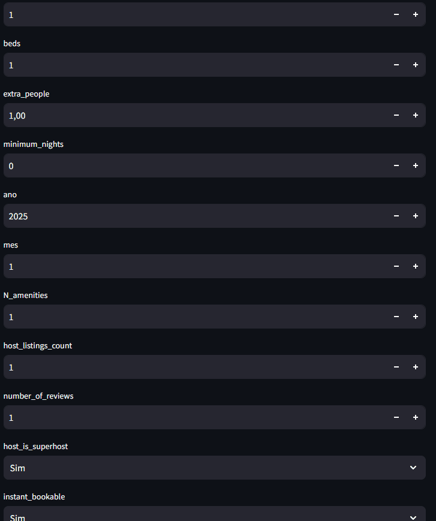

# 🏡 Airbnb Pricing Rio de Janeiro

Este projeto utiliza Machine Learning para prever o preço de imóveis no Rio de Janeiro anunciados no Airbnb. Criamos um modelo com dados históricos e desenvolvemos um app interativo com Streamlit.


---

## 🚀 Funcionalidades

- Previsão de preços com base nas características do imóvel
- Interface interativa desenvolvida com Streamlit
- Modelo de Machine Learning salvo com `joblib`
- Código limpo e modular com Jupyter Notebooks e app separado
- Pronto para deploy local

---

## 📂 Estrutura do Projeto

```
airbnb-pricing-rio/
├── notebooks/         # Jupyter Notebooks com análise e desenvolvimento
│   └── airbnb_modelo.ipynb
├── dataset/           # Dados históricos para treinamento do modelo (adicione os CSVs manualmente)
│   └── .gitkeep       # Mantém a pasta no repositório
├── app/               # Aplicação em Streamlit e modelo treinado
│   ├── dados.csv      # Arquivo de dados utilizado para a previsão
│   ├── modelo.joblib  # Modelo treinado
│   └── app.py         # Código do app em Streamlit
├── assets/            # Imagens, GIFs e outros recursos visuais
│   ├── demo.gif       # GIF demonstrativo da aplicação
│   └── airbnb-image.png
├── requirements.txt   # Dependências do projeto
├── .gitignore         # Arquivos e pastas ignoradas pelo Git
├── .gitattributes     # Configurações de atributos do Git
└── README.md          # Documentação do projeto
```

---

## 📦 Como rodar o projeto localmente

### 1. Clone o repositório

```bash
git clone https://github.com/seu-usuario/airbnb-pricing-rio.git
cd airbnb-pricing-rio/app
```

### 2. Instale as dependências

```bash
pip install -r ../requirements.txt
```

### 3. Execute o app com Streamlit

```bash
streamlit run app.py
```

---

## 🖼️ Demonstração do App

Veja o funcionamento do app em tempo real:



---

## 🔧 Tecnologias Utilizadas

- **Python**: Linguagem principal
- **Pandas**: Manipulação de dados
- **Scikit-learn**: Criação e treino do modelo de Machine Learning
- **Streamlit**: Criação da interface web
- **Joblib**: Salvamento e carregamento do modelo treinado

---

## 📥 Download dos Arquivos

Você pode baixar os arquivos necessários diretamente do [Google Drive](https://drive.google.com/drive/folders/1pzUiazh12EwBc7Lu5L0o-4wX4g9V5ybU?usp=drive_link).

> ⚠️ **Nota**: Os arquivos `.csv` de treino não estão incluídos no repositório por excederem o limite do GitHub. Para utilizar o projeto, baixe os datasets manualmente e coloque-os na pasta `dataset/`.

Para executar o app corretamente, também é necessário baixar o arquivo `dados.csv` e colocá-lo dentro da pasta `app/`.
Link para o Download do Arquivo dados.csv: (https://drive.google.com/drive/folders/1HCX0480h23uc0_HhSBCmZhH2ecJFXciE?usp=drive_link)
---

## ✨ Autor

**Guilherme Rodrigues de Quadros**

- 📧 Email: guilhermeddq@gmail.com  
- 💼 LinkedIn: [linkedin.com/in/guilhermedequadros](https://www.linkedin.com/in/guilhermedequadros/)

---

Se curtiu o projeto, ⭐️ deixe uma estrela

